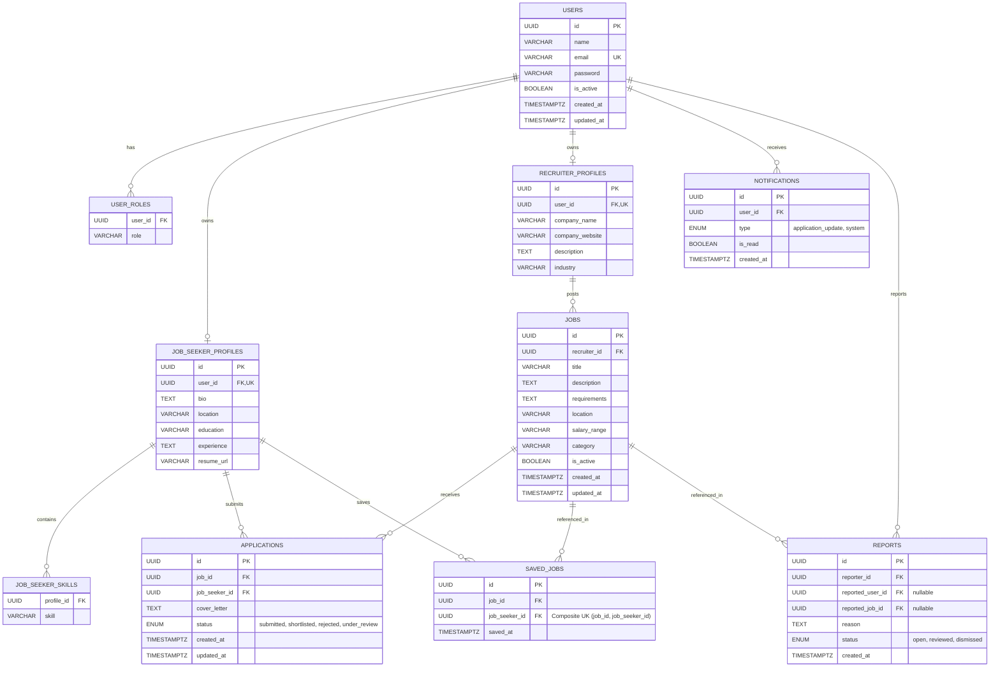

# Database Schema Design

The persistence layer uses a PostgreSQL relational database. Hibernate (Spring Data JPA) serves as the Object-Relational Mapper (ORM), while Flyway manages the database schema evolution through version-controlled migrations.

---

## 📊 Entity Relationship Diagram (ERD)

The database schema consists of 10 tables organized around core User profiles (Job Seeker / Recruiter) and core transactional operations (Jobs, Applications, Saved Jobs).



---

## 🗄️ Database Table Reference

### 1. `users`
Represents the base credentials and account status for all system actors.
- **Constraints**: 
  - `pk_users`: Primary key `id` (auto-generated UUID v4).
  - `uq_users_email`: Unique constraint on `email`.
- **Fields**:
  - `id`: `UUID` (Default: `gen_random_uuid()`)
  - `name`: `VARCHAR(255)` (Not Null)
  - `email`: `VARCHAR(255)` (Not Null, Unique)
  - `password`: `VARCHAR(255)` (Not Null)
  - `is_active`: `BOOLEAN` (Default: `TRUE`)
  - `created_at` / `updated_at`: `TIMESTAMPTZ` (Default: `NOW()`)

### 2. `user_roles`
A mapping table handling the multi-role model via JPA `@ElementCollection`.
- **Constraints**:
  - `fk_user_roles_user`: Foreign key references `users(id)` with `ON DELETE CASCADE`.
- **Fields**:
  - `user_id`: `UUID` (Not Null)
  - `role`: `VARCHAR(20)` (Not Null)

### 3. `job_seeker_profiles`
Contains profile details specific to the `JOB_SEEKER` role.
- **Constraints**:
  - `uq_job_seeker_profiles_user_id`: Unique constraint ensures a 1-to-1 relationship with `users`.
  - `fk_job_seeker_profiles_user`: Foreign key references `users(id)` with `ON DELETE CASCADE`.

### 4. `job_seeker_skills`
Stores list-based skills for a job seeker. Mapped via JPA `@ElementCollection`.
- **Constraints**:
  - `fk_job_seeker_skills_profile`: Foreign key references `job_seeker_profiles(id)` with `ON DELETE CASCADE`.

### 5. `recruiter_profiles`
Contains company profile details specific to the `RECRUITER` role.
- **Constraints**:
  - `uq_recruiter_profiles_user_id`: Unique constraint ensures a 1-to-1 relationship with `users`.
  - `fk_recruiter_profiles_user`: Foreign key references `users(id)` with `ON DELETE CASCADE`.

### 6. `jobs`
Stores job postings published by recruiters.
- **Constraints**:
  - `fk_jobs_recruiter`: Foreign key references `recruiter_profiles(id)` with `ON DELETE CASCADE`.

### 7. `applications`
Represents a job application submitted by a job seeker.
- **Constraints**:
  - `fk_applications_job`: Foreign key references `jobs(id)` with `ON DELETE CASCADE`.
  - `fk_applications_seeker`: Foreign key references `job_seeker_profiles(id)` with `ON DELETE CASCADE`.

### 8. `saved_jobs`
A join table facilitating "bookmarks" or saved jobs for job seekers.
- **Constraints**:
  - `uq_saved_job_seeker`: Composite unique constraint on `(job_id, job_seeker_id)`. Prevents duplicate saving of the same job.
  - `fk_saved_jobs_job`: Foreign key references `jobs(id)` with `ON DELETE CASCADE`.
  - `fk_saved_jobs_seeker`: Foreign key references `job_seeker_profiles(id)` with `ON DELETE CASCADE`.

---

## ⚡ Index Design & Query Optimization

Database queries are optimized using dedicated database indexes on high-traffic read operations. These indexes mirror the performance design from the original Prisma implementation:

### 1. Job Active Status Index
```sql
CREATE INDEX idx_job_is_active ON jobs(is_active);
```
- **Rationale**: The landing page and core job searches only show active listings. This index filters out inactive jobs instantly.

### 2. Composite Category Index
```sql
CREATE INDEX idx_job_is_active_cat ON jobs(is_active, category);
```
- **Rationale**: Optimizes job filtering by categories (e.g. `GET /api/jobs/all?category=Engineering`).

### 3. Recruiter Postings Index
```sql
CREATE INDEX idx_job_recruiter_ts ON jobs(recruiter_id, created_at DESC);
```
- **Rationale**: Speeds up queries on the recruiter dashboard (`GET /api/jobs/recruiter`), displaying their postings sorted chronologically by the latest first.

### 4. Paginated Job Directory Index
```sql
CREATE INDEX idx_job_active_ts ON jobs(is_active, created_at DESC);
```
- **Rationale**: Supports default paginated queries which list all active jobs ordered by publication date (`GET /api/jobs/all?page=1&pageSize=10`).

---

## 🔄 Schema Migration & JPA Validation

### 1. Flyway Version-Controlled Schema
Migrations are stored as sql scripts inside `src/main/resources/db/migration/`:
- **`V1__initial_schema.sql`**: Contains full DDL, defining tables, constraints, custom postgres types (enums), and indices.
- **`V2__seed_data.sql`**: Inserts mock users (pre-hashing passwords with BCrypt), recruiter profiles, job seekers, jobs, applications, and bookmark records.

### 2. JPA Schema Verification Strategy
To prevent deviations between the Spring Boot domain models and the SQL tables, the application profile is configured to **validate** the schema rather than mutate it:
```yaml
spring:
  jpa:
    hibernate:
      ddl-auto: validate
```
This requires that any model updates must be written as a Flyway migration file first. On startup, Hibernate compares the entity metadata with the database schema and blocks application initialization if a discrepancy is detected.
