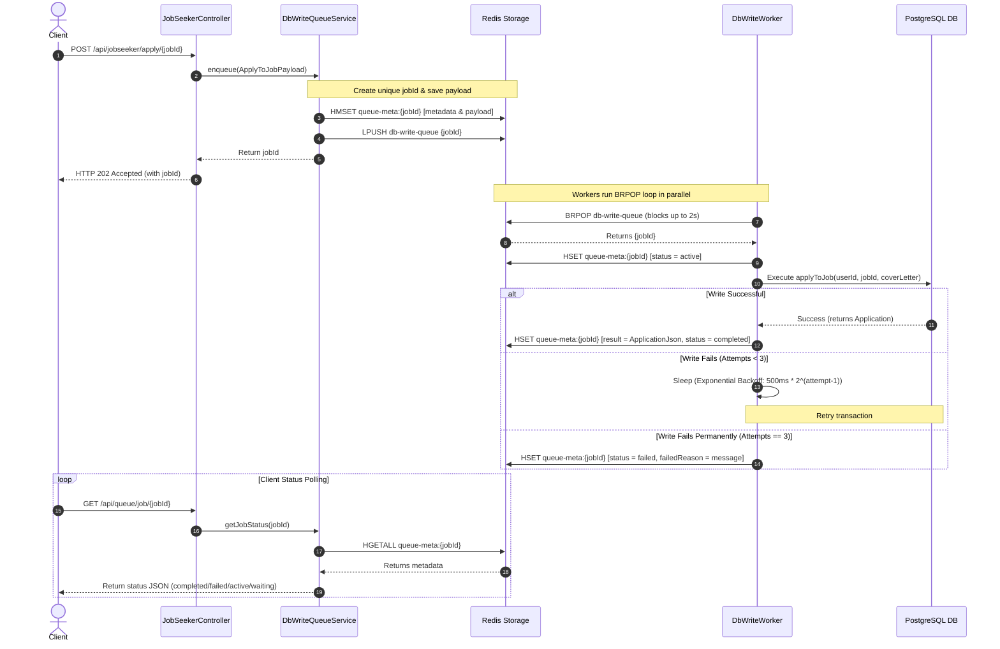

# Redis-Backed Asynchronous Queue Design

To prevent database bottlenecks and ensure rapid response times, the application implements an asynchronous write-behind pattern. High-traffic database write operations—specifically, applying to a job and saving a job—are queued via Redis and processed by background worker threads. This replaces the Bull queue setup from the Node.js implementation with identical functional semantics.

---

## 📈 Queue Architecture & Data Flow

When a user triggers a write operation, the API immediately enqueues the job and responds to the client with `202 Accepted`. The actual database persist action is deferred to a background pool.



---

## 🗄️ Redis Data Structures

The system leverages two primary Redis data structures to manage the queue:

### 1. Job ID Queue (Redis LIST)
- **Key**: `db-write-queue`
- **Structure**: A standard Redis list.
- **Operations**:
  - **Enqueue**: `DbWriteQueueService` performs an `LPUSH` (left-push) operation to add a newly generated job UUID to the tail of the list.
  - **Dequeue**: `DbWriteWorker` threads perform a `BRPOP` (blocking right-pop) operation to retrieve a job UUID.

### 2. Job Metadata (Redis HASH)
- **Key Pattern**: `queue-meta:{jobId}`
- **Structure**: A Redis Hash mapping string keys to string values.
- **Fields**:
  - `id`: Unique Job UUID.
  - `type`: Discriminator for execution routing (`apply-to-job` or `save-job`).
  - `status`: The current execution state. Values: `waiting`, `active`, `completed`, or `failed`.
  - `attemptsMade`: Counter tracks attempts (ranges from `0` to `3`).
  - `createdAt`: ISO-8601 string of job creation timestamp.
  - `payload`: JSON-serialized string containing execution payload (e.g. `userId`, `jobId`, `coverLetter`).
  - `result`: JSON-serialized representation of the database record on completion.
  - `failedReason`: Detailed exception message if processing fails permanently.

---

## 🧵 Concurrency & Execution Thread Pool

To prevent high-concurrency requests from spinning up excessive threads, the system uses a dedicated Spring `ThreadPoolTaskExecutor` defined in `AsyncConfig`:

### Executor Configuration: `queueWorkerExecutor`
```java
ThreadPoolTaskExecutor executor = new ThreadPoolTaskExecutor();
executor.setCorePoolSize(concurrency);
executor.setMaxPoolSize(concurrency);
executor.setQueueCapacity(0); // SynchronousQueue
executor.setThreadNamePrefix("queue-worker-");
executor.setWaitForTasksToCompleteOnShutdown(true);
executor.setAwaitTerminationSeconds(30);
```

### Critical Design Decision: `setQueueCapacity(0)`
By setting the capacity to `0`, Spring allocates a `SynchronousQueue` instead of a buffering queue (`LinkedBlockingQueue`).
- **Why?** A synchronous queue prevents tasks from being buffered in the Java application's JVM memory. If the application crashes, buffered tasks in memory are lost.
- **Safety**: With `QueueCapacity(0)`, tasks are either immediately consumed by active worker threads or rejected if all worker threads are occupied. Since the concurrency pool size matches the count of polling worker loops, the threads are always dedicated, and the actual queue buffering is offloaded to Redis (which is durable).

---

## 🔄 Worker Lifecycle & Polling

### 1. Startup (`@PostConstruct`)
On application initialization, `DbWriteWorker` spins up $N$ worker threads (configured via `app.queue.concurrency`, default `5`). Each thread runs `runWorkerLoop()` in the dedicated thread pool:
```java
for (int i = 0; i < concurrency; i++) {
    queueWorkerExecutor.execute(this::runWorkerLoop);
}
```

### 2. The Blocking BRPOP Polling Loop
Each worker thread executes an infinite loop running `redisTemplate.opsForList().rightPop(..., Timeout, TimeUnit.SECONDS)`.
- **Non-blocking sleep (BRPOP)**: The thread blocks at the Redis network connection level for up to 2 seconds waiting for a new job ID.
- **Resource conservation**: Because the thread is blocked on the Redis socket rather than active execution, it consumes negligible CPU. If no job arrives within 2 seconds, the call returns `null`, and the thread initiates the next polling iteration.

### 3. Graceful Shutdown (`@PreDestroy`)
When Spring Context initiates a shutdown:
1. `active` flag is set to `false`.
2. Active worker threads are interrupted.
3. The executor waits for up to 30 seconds for active jobs to complete before force-terminating.

---

## 🛡️ Retry Policy & Exponential Backoff

Queue operations interact with the database and are susceptible to transient network glitches, database lock timeouts, or deadlocks. To guarantee eventual consistency, a robust retry policy is enforced:

- **Maximum Attempts**: 3.
- **Backoff Base Delay**: 500 milliseconds.
- **Backoff Formula**:
$$\text{delay} = \text{BACKOFF\_MS} \times 2^{\text{attempt} - 1}$$

| Attempt | Delay before retry |
| :--- | :--- |
| **Attempt 1** | Immediate execution |
| **Attempt 2** | 500 ms |
| **Attempt 3** | 1000 ms |
| **Failed** | Permanently failed; metadata status set to `failed` |
