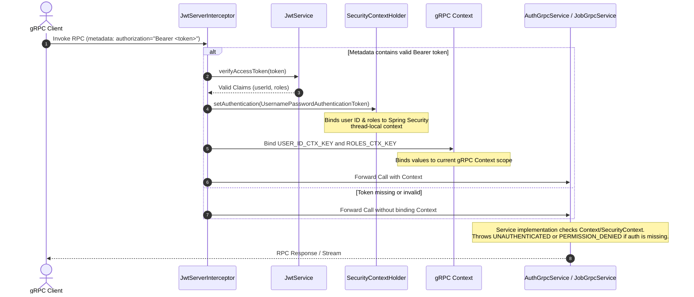
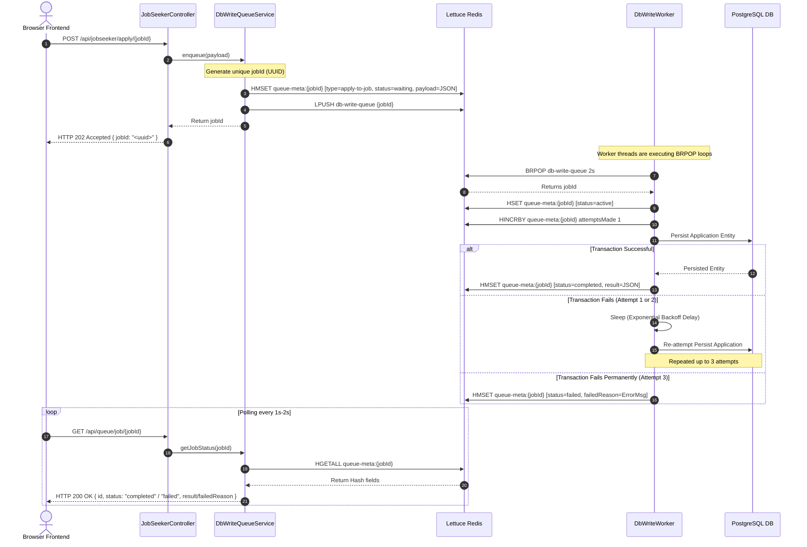

# Technical Sequence Flows

This document details the step-by-step runtime sequence diagrams for critical operations in the system, focusing on Authentication (REST and gRPC) and the Asynchronous Queue.

---

## 🔐 1. REST Authentication & Token Rotation Flow

This diagram describes the interaction during a user login and subsequent token refresh (rotation) operation. Token storage is handled entirely via HTTP-only cookies, preventing JavaScript access.

```mermaid
sequenceDiagram
    autonumber
    actor Client as Browser / Frontend
    participant Tomcat as Tomcat Server
    participant AuthController as AuthController
    participant AuthService as AuthService
    participant JwtService as JwtService
    participant DB as PostgreSQL DB

    %% Login Flow
    Note over Client, DB: 1. User Login Flow
    Client ->> Tomcat: POST /api/auth/login [credentials]
    Tomcat ->> AuthController: login(LoginRequest)
    AuthController ->> AuthService: authenticate(email, password)
    AuthService ->> DB: Fetch User by Email
    DB -->> AuthService: User Details (hashed password)
    AuthService ->> AuthService: Validate Password (BCrypt)
    AuthService ->> JwtService: generateAccessToken(userId, roles)
    JwtService -->> AuthService: JWT Access Token (15 min)
    AuthService ->> JwtService: generateRefreshToken(userId)
    JwtService -->> AuthService: JWT Refresh Token (7 days)
    AuthService ->> JwtService: setTokenCookies(response, access, refresh)
    Note over JwtService: Sets Cookie headers:<br/>accessToken (HttpOnly; SameSite=Lax)<br/>refreshToken (HttpOnly; SameSite=Lax)
    AuthService -->> AuthController: Return User ID & Roles
    AuthController -->> Client: HTTP 200 OK [JSON: userId, roles] + Cookies

    %% API Access Flow (Authenticated)
    Note over Client, DB: 2. API Request with Access Token
    Client ->> Tomcat: GET /api/jobseeker/profile (with accessToken cookie)
    Note over Tomcat: CookieAuthFilter intercepts request,<br/>verifies accessToken, and binds authentication<br/>to SecurityContextHolder
    Tomcat ->> Client: HTTP 200 OK [Profile Data]

    %% Token Expiry & Refresh Flow
    Note over Client, DB: 3. Access Token Expires (15 mins later)
    Client ->> Tomcat: GET /api/jobseeker/profile (Expired token)
    Tomcat -->> Client: HTTP 401 Unauthorized

    Client ->> Tomcat: POST /api/auth/refresh (with refreshToken cookie)
    Tomcat ->> AuthController: refresh()
    AuthController ->> AuthService: refreshTokens(refreshToken)
    AuthService ->> JwtService: verifyRefreshToken(token)
    JwtService -->> AuthService: Validated Claims (userId)
    AuthService ->> DB: Verify User exists & is active
    DB -->> AuthService: User Status (Active)
    AuthService ->> JwtService: generateAccessToken(userId, roles)
    JwtService -->> AuthService: New JWT Access Token
    AuthService ->> JwtService: generateRefreshToken(userId)
    JwtService -->> AuthService: New JWT Refresh Token (Rotation)
    AuthService ->> JwtService: setTokenCookies(response, newAccess, newRefresh)
    AuthService -->> AuthController: Return User ID & Roles
    AuthController -->> Client: HTTP 200 OK [JSON: userId, roles] + New Cookies
```

---

## 🔌 2. gRPC Authentication Interception Flow

For gRPC integrations, authentication is handled via metadata headers (equivalent to HTTP headers). The sequence highlights how a custom server interceptor maps JWT validation to both gRPC and Spring Security contexts.



---

## 🔁 3. Asynchronous Queue Processing & Status Polling

This sequence details the interactions that occur when a Job Seeker applies to a job. The client enqueues the action, receives a quick response, and polls for completion while background workers process the task.


