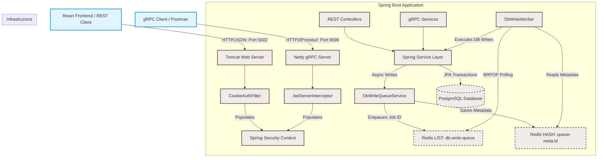

# System Architecture

The **Job Finder Backend** is a high-performance, role-based job board service. It is designed around clean architecture principles and a hybrid, dual-protocol communication model, leveraging asynchronous execution patterns to handle high-write operations under heavy load.

---

## 🛠 Technology Stack

| Layer | Technology | Version | Rationale |
| :--- | :--- | :--- | :--- |
| **Runtime** | Java LTS | 21 | Modern language features (Virtual Threads capability, Pattern Matching, Record classes). |
| **Framework** | Spring Boot | 3.4 | Core framework for dependency injection, bean management, configuration, and security. |
| **HTTP Web MVC** | Spring Web | 3.4 | Routing, REST controller lifecycle, JSON serialization (Jackson), and HTTP filtering. |
| **gRPC Server** | gRPC / Netty | 1.68+ | High-performance, binary dual-protocol option for low-latency client integration. |
| **Database ORM** | Hibernate / Spring Data JPA | 6.x / 3.4 | Relational mapping, query compilation, dynamic pagination, and transactional control. |
| **Database** | PostgreSQL | 16 | ACID-compliant relational storage supporting native UUIDs, Enums, and advanced indexing. |
| **Migrations** | Flyway | 10.x | Reproducible, version-controlled schema migrations running deterministically on startup. |
| **Caching/Queueing** | Redis (Lettuce Client) | 7.x / 3.4 | High-throughput, memory-resident data store acting as the message broker for the async queue. |
| **Security** | Spring Security / JJWT | 6.4 / 0.12 | Stateless token validation, role-based authorization, CORS, and password hashing (BCrypt). |
| **Rate Limiting** | Bucket4j | 8.x | Token-bucket rate-limiting algorithm applied in-memory per-IP to prevent spam. |
| **AOT Compiler** | GraalVM Native Image | 21 | Compiles bytecode directly to native machine code, lowering startup times and memory footprint. |

---

## 🏗 High-Level System Layout

The application operates on a hybrid architecture, simultaneously exposing a REST API on port `5002` (via embedded Tomcat) and a gRPC Server on port `9090` (via Netty). Both protocols share the same Spring Service layer, Database layer, and Redis Queue.



---

## 📁 Package & Directory Structure

The project code is organized into feature-driven and layer-driven directories under `src/main/java/com/jobfinder/`:

- **`config/`**  
  Infrastructure and framework configurations. Sets up Spring Security chains, CORS configurations, Redis Lettuce clients, thread-pool task executors, and rate-limiting structures.
- **`controller/`**  
  HTTP REST controllers mapping incoming requests to services. Exposes endpoints for auth, jobs, profiles, and queue status polling.
- **`grpc/`**  
  gRPC service implementations. Exposes the Protobuf definitions via Netty, handles token parsing via `JwtServerInterceptor`, and maps Protobuf messages to Spring Security and DTO structures.
- **`domain/`**  
  Relational data models mapped as JPA (`@Entity`) classes. Contains relationships, collection mappings, custom annotations, and Hibernate lifecycle mappings.
- **`repository/`**  
  Spring Data JPA repository interfaces acting as the Data Access Object (DAO) layer. Exposes built-in and custom JPQL database operations.
- **`dto/`**  
  Data Transfer Objects split into `request/` and `response/` packages. Used for serializing/deserializing payloads, mapping DB models to API payloads, and executing Jakarta Bean validations (`@Valid`).
- **`service/`**  
  Core business logic layer. Implements transactional actions, database state management, token generation, and user validation rules.
- **`queue/`**  
  Asynchronous queue infrastructure. Contains serialization DTOs (Payloads), enqueueing helper services, and concurrent background workers (`DbWriteWorker`).
- **`enums/`**  
  Global domain-specific constants and types (e.g. `Role`, `ApplicationStatus`, `NotificationType`, `ReportStatus`).
- **`exception/`**  
  Custom typed exceptions (`AppException`, `ResourceNotFoundException`, `ConflictException`, etc.) coupled with `GlobalExceptionHandler` (`@ControllerAdvice`) to guarantee consistent JSON error formatting.

---

## 🛡 Security Architecture

Security is built on a stateless model with strong browser-side defenses against Cross-Site Scripting (XSS) and Cross-Site Request Forgery (CSRF).

### 1. Dual HttpOnly Cookie Model (REST)
Access and refresh tokens are never transmitted in JSON response bodies to REST clients. Instead, they are placed directly into response cookies:
- **`accessToken`**: Short-lived (15 minutes), containing the user ID and assigned role authorities.
- **`refreshToken`**: Long-lived (7 days), containing only the user ID. Used to fetch a new access token when it expires.

Both cookies are configured with critical security attributes:
- **`HttpOnly`**: Set to `true` to ensure they are invisible to client-side JavaScript, neutralizing XSS-based token extraction.
- **`SameSite=Lax`**: Protects against CSRF on state-changing cross-origin requests (`POST`, `PUT`, `PATCH`, `DELETE`) while permitting normal top-level navigation.
- **`Path=/`**: Restricts cookie transmission to API paths.

### 2. Spring Security Chain
All requests pass through `CookieAuthFilter` before hitting the endpoint router. The filter:
1. Extracts the `accessToken` cookie.
2. Validates the signature and checks the expiration.
3. Decodes user ID and roles, translating them into `SimpleGrantedAuthority` collections.
4. Binds a `UsernamePasswordAuthenticationToken` to the thread-local `SecurityContextHolder`.

Methods are protected with fine-grained annotation-based guards:
```java
@PreAuthorize("hasRole('RECRUITER')")
```

### 3. Rate Limiting (Bucket4j)
To protect against brute-force logins and automated script spam, an in-memory token-bucket rate limiter acts at the controller level:
- **Signups**: Limited to **5 requests per 1 hour** per IP address.
- **Logins / Refreshes**: Limited to **10 requests per 15 minutes** per IP address.

---

## 🔁 gRPC Dual-Protocol Integration

The gRPC implementation serves as a lightweight, binary RPC protocol alternative:
- **Service definitions** are written in `.proto` files, which auto-generate the base Java classes.
- **Authentication** is handled using standard gRPC `Metadata`. A global `JwtServerInterceptor` extracts the `authorization` header (using the standard `Bearer <token>` scheme), parses the token via `JwtService`, and populates both the gRPC `Context` (for thread-safe service-layer access) and the Spring `SecurityContextHolder`.
- **Response Streaming**: Endpoints like `ListJobs` stream results back to the client, providing real-time data ingestion for connected microservices.

---

## 🚀 Native Compilation (GraalVM)

For cloud-native deployments, the application can be built into a standalone OS binary using **GraalVM Native Image**.

```
Source Code (Java) ➔ AOT Compiler (GraalVM) ➔ Native Machine Binary (No JVM Required)
```

### Key Native Compilation Differences:
1. **Startup Speed**: Drops from ~3-5 seconds on a JVM down to **less than 100 milliseconds** (typically ~70-80ms).
2. **Memory Footprint**: Drops dramatically because the runtime does not require a JVM memory stack, class loaders, or JIT compiler infrastructure.
3. **Build Profile**: Handled via `Dockerfile.native` using Maven profiles (`native`), compiling all dependency classes Ahead-Of-Time (AOT).
